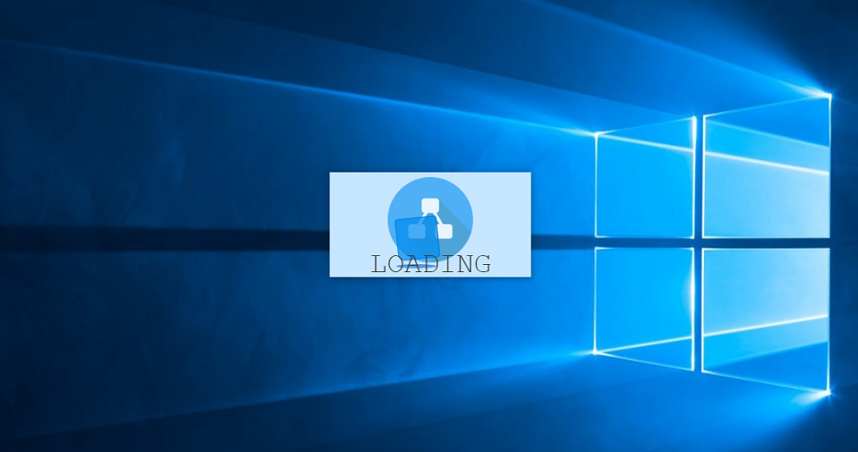
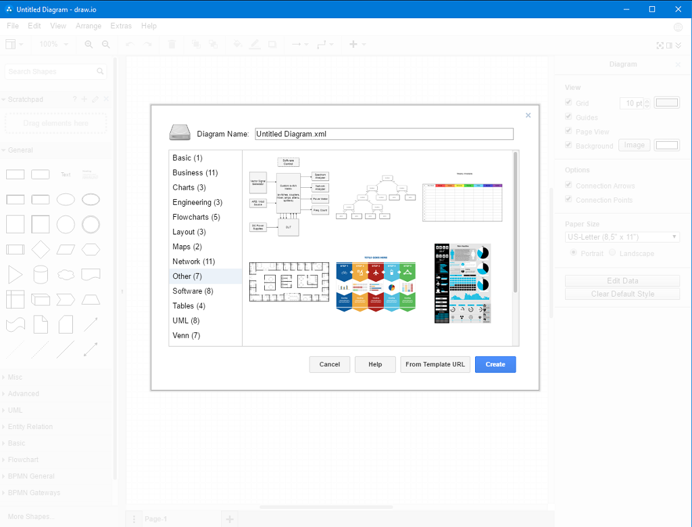
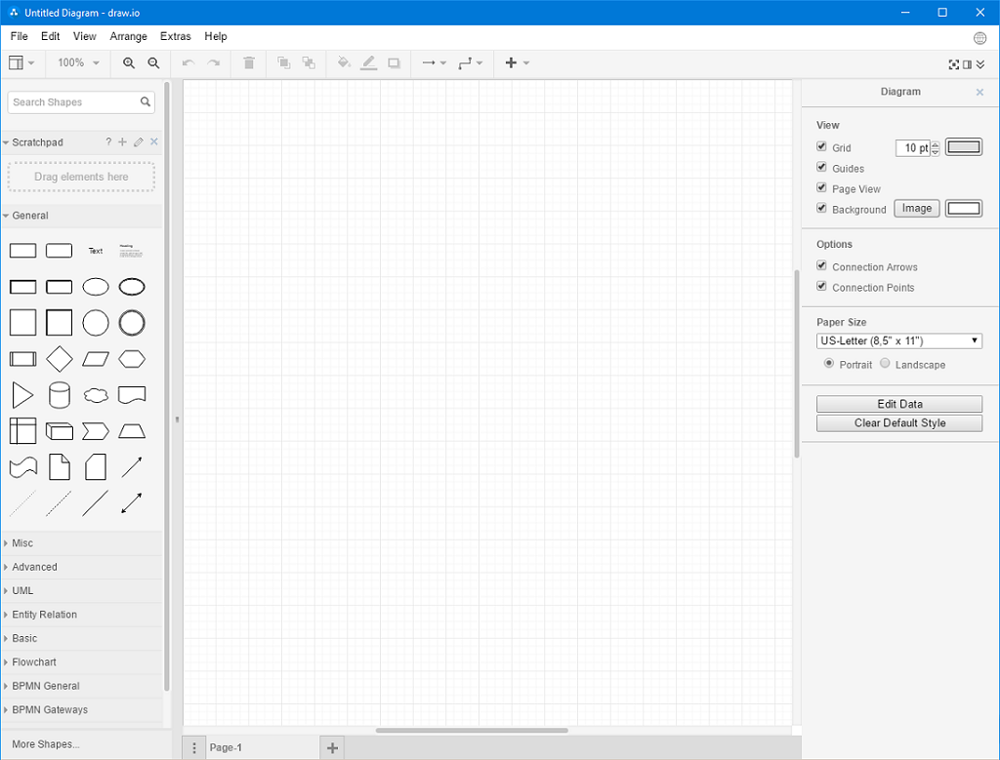

# DrawTop - Draw.io Desktop Application (Unofficial)

DrawTop is online-based, cross platform desktop application for [Draw.io diagraming software](https://www.draw.io) (**`unofficial`**). It is built using web technologies (HTML, CSS and JavaScript) and [electron framework](https://electron.atom.io/).


**Important note:**
```
All product names, logos, and brands are property of their respective owners.
All company, product and service names used in this project are for identification purposes only.
Use of these names, logos, and brands does not imply endorsement.
```

----------

## Quick Preview

Loader animation:



Templates:




Workspace:



----------

## How does it work?

- When first starting DrawTop application, frameless loader window is created;
- DrawTop then checks in the background for available internet connections;
- If there is no internet access:
1. loader window is closed;
2. frameless help window is created, notifying user about nonexistent internet access;
3. global keyboard shortcut is registered for `Escape` key, allowing user to close help window and exit application.
-  If there is internet access:
1. loader window is closed;
2. main window is created, loading Draw.io website into secure [chromium sandbox](https://chromium.googlesource.com/chromium/src/+/master/docs/design/sandbox.md) environment, with node integration disabled;
3. global keyboard shortcut is registered for `F11` key, allowing user to toggle full screen view.

**NOTE:** When loading Draw.io website, following URL parameters are used:

1. `https=1` - enables encrypted https connection to Draw.io website;
2. `offline=0` - loads Draw.io in an online environment, which enables faster loading time, use of templates, search functionality and multiple language support;
3. `mode=device` - sets default application mode to "device";
4. `storage=device` - adds device storage option for touch devices;
5. `splash=1` - shows splash screen by default;
6. `db=0` - disables Dropbox APIs;
7. `gapi=0` - disables Google APIs;
8. `od=0` - disables OneDrive APIs;
9. `gh=0` - disables GitHub APIs;
10. `browser=0` - disables local (browser) storage as a storage location;
11. `picker=0` - disables Google picker in Dialogs;
12. `analytics=0` - disables Google Analytics.

For more information about available URL parameters, please visit [Draw.io support page](https://desk.draw.io/support/solutions/articles/16000042546-what-url-parameters-are-supported-).

----------

## For developers

### To Use:

To clone and run this repository you'll need [Git](https://git-scm.com) and [Node.js](https://nodejs.org/en/download/) (which comes with [npm](http://npmjs.com)) installed on your computer. From your command line:

```sh
# Clone repository
git clone https://github.com/MilanG-Ne/DrawTop

# Navigate to folder
cd DrawTop

# Install dependencies
npm install

# Start application
npm start
```

**Note:** If you're using Linux Bash for Windows, [see this guide](https://www.howtogeek.com/261575/how-to-run-graphical-linux-desktop-applications-from-windows-10s-bash-shell/) or use `node` from the command prompt.

### Packaging:

From your command line:

```sh
# Windows (also known as win32, for both 32/64 bit)
npm run pack-win

# OS X (also known as darwin) / Mac App Store (also known as mas)*
npm run pack-mac

# Linux (for x86, x86_64, and armv7l architectures)
npm run pack-linux
```

**Note:** for OS X / MAS target bundles: the .app bundle can only be signed when building on a host OS X platform.

More information about [using electron-packager](https://github.com/electron-userland/electron-packager).

----------

## Resources for Draw.io

- [Draw.io website](https://www.draw.io) - Draw.io website homepage;
- [Draw.io desktop](https://chrome.google.com/webstore/detail/drawio-desktop/pebppomjfocnoigkeepgbmcifnnlndla?hl=en-GB) - Official Draw.io desktop application (Google Chrome application, runs offline);
- [Draw.io on GitHub](https://github.com/jgraph/drawio) - Draw.io on GitHub (source to Draw.io);
- [Draw.io add-on](https://support.draw.io/display/DAFGD) - Draw.io add-on for Google Docs;
- [Draw.io manual](https://support.draw.io/display/DO/Draw.io+Online+User+Manual) - Draw.io online user manual;
- [Draw.io support](https://support.draw.io/display/SUP/draw.io+Support+Home) - Draw.io support homepage.

----------

## Resources for Electron

- [electron.atom.io/docs](http://electron.atom.io/docs) - all of Electron's documentation;
- [electron.atom.io/community/#boilerplates](http://electron.atom.io/community/#boilerplates) - sample starter apps created by the community;
- [electron/electron-quick-start](https://github.com/electron/electron-quick-start) - a very basic starter Electron app;
- [electron/simple-samples](https://github.com/electron/simple-samples) - small applications with ideas for taking them further;
- [electron/electron-api-demos](https://github.com/electron/electron-api-demos) - an Electron app that teaches you how to use Electron;
- [hokein/electron-sample-apps](https://github.com/hokein/electron-sample-apps) - small demo apps for the various Electron APIs.

----------

## License:

[Apache-2.0](LICENSE.md)
